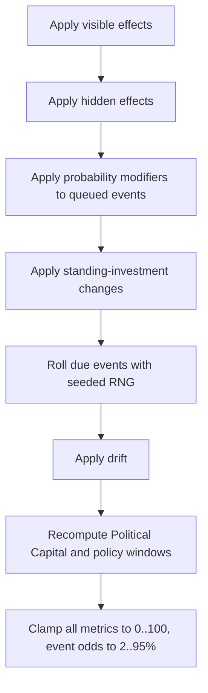

# Claude Code Build Handoff

2026-09-18 · @Someone

Build AI 2032 to the v2 specification in the first tab of this doc. This tab is the operational brief: stack, repo layout, phased plan with acceptance gates, and the CLAUDE.md to start from. Where this tab and the spec disagree, the spec wins; raise the conflict rather than guessing.

## 1. How to work

Seven rules for the agent building this.

1. **Read the spec tab first, in full.** Sections 5, 6, 9 and 12 are the contract for state, uncertainty, scenarios and types. Do not begin coding until you can restate the engine contract in Section 3 below.
2. **Engine before interface.** No React until Phase 1's tests pass. A pretty screen over a broken reducer is negative progress.
3. **Content is data, never code.** Every scenario, effect and probability lives in JSON validated by Zod. If you find yourself writing `if (scenarioId === ...)` in the engine, stop: the rule belongs in the schema or the data.
4. **Determinism is sacred.** All randomness flows through one seeded generator in state. A single `Math.random()` anywhere is a defect that fails the build.
5. **Work in vertical slices with gates.** Each phase in Section 4 has an acceptance test. Do not start a phase until the previous gate is green. Commit at each gate.
6. **Ask when the spec is silent or self-contradictory.** Record the question in `DECISIONS.md` with the choice you made and why. Do not invent game-balance numbers not in the spec; use the spec's numbers and let the balance harness tell you if they fail.
7. **No new dependencies without asking.** The allowed set is in Section 2. Anything else needs a one-line justification and sign-off.

The measure of success is not lines of code. It is that a first-time player finishes in under 30 minutes and afterwards argues about a decision they would defend despite its outcome.

## 2. Stack, repo layout and tooling

Static single-page app, no backend, no auth, no database. State lives in memory; a seed code in the URL query string makes any run reproducible and shareable.

| Concern | Choice | Note |
| --- | --- | --- |
| Language | TypeScript, strict | `strict: true`, `noUncheckedIndexedAccess: true` |
| Build | Vite | Fast dev server, static output |
| UI | React 18 | Function components and hooks only |
| Styling | Tailwind | Sober briefing aesthetic; see spec Section 14 |
| Validation | Zod | Every content file parsed at load |
| Charts | Recharts | Calibration chart, metric history |
| Tests | Vitest | Engine and content are the priority |
| Workers | Native Web Worker | Counterfactual reruns off the main thread |

No state library: `useReducer` wraps the pure engine. No router: one page with view state. No CSS-in-JS. No animation library; use CSS transitions and respect `prefers-reduced-motion`.

**Repository layout**

```text
ai-2032/
  CLAUDE.md                 # Section 8 of this handoff
  DECISIONS.md              # log of choices where the spec was silent
  README.md                 # how to run, build, test
  index.html
  package.json
  tsconfig.json
  vite.config.ts
  vitest.config.ts
  src/
    engine/                 # PURE. No React, no DOM, no Math.random.
      rng.ts                # mulberry32 seeded generator
      types.ts              # the data model from spec Section 12
      seed.ts               # world-seed draw (spec Section 6)
      reduce.ts             # reduce(state, action, content)
      display.ts            # displayed(state): noise bands + labels
      resolve.ts            # event-queue resolution and probability clamp
      scoring.ts            # Brier score, luck tags, endings
      simulate.ts           # headless runner for the balance harness
      index.ts              # public engine API
    content/
      scenarios/*.json      # one file per scenario (spec Section 9)
      advisers.json
      endings.json
      schema.ts             # Zod schemas; parse everything on load
      load.ts               # validated loader, fails loud on bad content
    ui/
      App.tsx
      screens/              # Briefing, Forecast, Decision, Invest, News, Debrief
      components/           # MetricBar, EstimateBand, EvidenceTag, AdviserCard
      theme.css
    workers/
      counterfactual.worker.ts
    main.tsx
  scripts/
    balance.ts              # runs simulate across profiles; used in CI
  tests/
    engine/*.test.ts
    content/*.test.ts
```

The `engine/` and `content/` directories must not import from `ui/`. Enforce it with an ESLint no-restricted-imports rule so a violation fails CI, not just review.

## 3. The engine contract

The engine is the whole game. Everything else renders it. It exposes exactly this surface, matching spec Section 12; nothing else reaches into engine internals.

```ts
// src/engine/index.ts
export function createGame(seedCode: string, content: Content): GameState;
export function reduce(state: GameState, action: Action, content: Content): GameState;
export function displayed(state: GameState): DisplayedState;
export function simulate(strategy: Strategy, runs: number, content: Content): SimResult;
export function counterfactual(
  history: DecisionRecord[],
  changeAt: number,
  newChoiceId: string,
  runs: number,
  content: Content,
): CounterfactualResult;
```

Four invariants. Break any and the build is wrong even if it looks right.

1. **Purity.** `reduce` returns a new state and touches nothing outside its arguments: no dates, no network, no DOM, no module-level mutable state. Same inputs, same output, forever.
2. **One source of randomness.** Every draw calls the generator threaded through `GameState.rngState`. Grep the engine for `Math.random`, `Date.now`, `crypto` and `performance`: zero hits.
3. **Truth stays in the engine.** `GameState.metrics` holds true values. `displayed(state)` is the only function that adds noise bands and the State Capacity label. No component may read `systemicRisk`, `cooperation` or the numeric `stateCapacity` except through `displayed`, and even then only after the debrief unlocks true values.
4. **Odds are frozen at decision time.** When a decision is taken, write the then-current probability of each affected event into the `DecisionRecord`. Luck tags and counterfactuals read those stored odds; they never recompute them from a later state.

Resolution order within a turn, to remove ambiguity:



If the spec leaves an ordering question open, this diagram decides it, and you note the point in `DECISIONS.md`.

## 4. Phased build plan

Seven phases. Each has one acceptance gate that must be green before the next begins. Commit at every gate.

### Phase 0: Scaffold

Vite, TypeScript strict, Tailwind, Vitest, ESLint with the engine-isolation rule. Empty `engine/index.ts` exporting typed stubs. CLAUDE.md, DECISIONS.md, README.md in place.

*Gate:* `npm run dev`, `npm run build`, `npm run test` and `npm run lint` all succeed on an empty project.

### Phase 1: Engine core

`rng.ts`, `types.ts`, `seed.ts`, `reduce.ts`, `display.ts`, `resolve.ts`, `scoring.ts`. No content beyond a tiny fixture scenario used only in tests.

*Gate:* the Phase 1 tests in Section 6 pass, including determinism across 100 runs, purity, band-width formula, clamping and Political-Capital rules.

### Phase 2: Content and schema

Zod schemas for `Scenario`, `Choice`, `Adviser`, `Ending`. Loader that fails loudly on malformed content. All six scenarios, the incident interrupt, advisers and endings authored as JSON from spec Section 9 and 10.

*Gate:* every content file parses; the option-design tests (rules 1, 2, 6 from spec Section 8) pass for all scenarios.

### Phase 3: Balance harness

`simulate.ts` and `scripts/balance.ts`. Run 10,000 games per world profile for the three fixed strategies.

*Gate:* no fixed strategy produces the best ending score in more than 40% of runs (spec Section 8, rule 7). If it fails, adjust the spec's numbers in the JSON and rerun; log each change in DECISIONS.md. Do not move on until it passes.

### Phase 4: Turn interface

Briefing, Forecast slider, optional Buy Information, Decision, Standing Investment, Consequences with headlines. Estimated metrics render as a band with a midpoint, never a single number. Evidence and severity are text labels in a fixed position.

*Gate:* a playtester completes a full seven-turn run in the browser without reading code or docs.

### Phase 5: Crisis turns and the interrupt

Crisis variant: cosmetic countdown, no information purchase, reduced evidence text, investment-unlocked options surfaced. Incident interrupt fired from the queue, with the false-alarm fallback.

*Gate:* both crisis turns render differently from normal turns; an unlocked option appears only when its investment threshold is met.

### Phase 6: Debrief and counterfactuals

The six panels from spec Section 11. Calibration chart in Recharts. Luck tags from stored odds. Counterfactual reruns of 1,000 games in a Web Worker, phrased as model assumptions with a "view assumptions" affordance. Further-reading lists from spec Section 15 in panel 4.

*Gate:* 1,000-run counterfactuals complete in under 3 seconds without freezing the UI; the calibration chart matches a hand-checked Brier score on a scripted run.

### Phase 7: Polish and facilitator mode

Responsive layout, WCAG 2.2 AA, keyboard operability, `prefers-reduced-motion`, light and dark. Facilitator settings panel to edit world-profile odds and scenario probabilities and rerun. Shareable seed code round-trips through the URL.

*Gate:* an automated accessibility pass (axe) reports no serious violations; the same seed code reproduces an identical run start to finish.

## 5. Content authoring

Each scenario in spec Section 9 becomes one JSON file that satisfies the `Scenario` schema. The spec's option tables give visible and hidden effects; you supply the machinery that makes them resolve. Worked example, faithful to Scenario 1:

```json
{
  "id": "attribution-gap",
  "date": "2027-01",
  "title": "The Attribution Gap",
  "briefing": "A UK logistics firm is breached. Responders say an AI agent executed most of the intrusion. The developer disputes the figure and outside experts split on how autonomous it was.",
  "isCrisis": false,
  "domain": "cyber",
  "evidenceStrength": "moderate",
  "severity": "high",
  "forecast": {
    "question": "Chance of a disruptive AI-enabled attack on UK critical infrastructure by the end of 2029.",
    "resolvesBy": "2029-12",
    "resolution": { "eventId": "infra-attack-2029" }
  },
  "infoPurchase": { "fact": "cyberOffenceLed" },
  "adviserViews": {
    "shah": { "stance": "The autonomy figure is contested; do not price a disputed number as fact.", "recommends": "A" },
    "harcourt": { "stance": "We do not get to run the experiment twice.", "recommends": "C" },
    "chen": { "stance": "Market-access conditions will cost us launches.", "recommends": "A" },
    "okafor": { "stance": "Operators outside government carry this risk too.", "recommends": "D" }
  },
  "choices": [
    {
      "id": "C",
      "text": "Pre-deployment cyber evaluation as a condition of UK market access.",
      "lever": "marketAccess",
      "politicalCost": 4,
      "restrictive": true,
      "visibleEffects": { "nationalSecurity": 4, "innovation": -3 },
      "hiddenEffects": { "stateCapacity": 4 },
      "probabilityModifiers": [{ "eventId": "infra-attack-2029", "delta": -10 }],
      "conditionalEffects": [
        { "when": [{ "flag": "developer-delays-uk" }], "effects": { "innovation": -4, "economy": -2 } }
      ],
      "trackChange": null,
      "flagsAdded": [],
      "flagsRemoved": [],
      "queues": [
        {
          "eventId": "developer-delay-roll",
          "earliestTurn": 2,
          "latestTurn": 2,
          "baseProbability": { "benign": 20, "contested": 20, "hard": 20 },
          "sourceChoiceId": "C"
        }
      ],
      "requires": []
    }
  ],
  "evidencePanel": {
    "known": "An AI model automated most of a real intrusion lifecycle in a 2025 case.",
    "unknown": "How much was truly autonomous versus human-directed.",
    "whyItMatters": "The autonomy fraction changes how far ahead of defence the offence sits.",
    "sources": [
      { "label": "Anthropic, Disrupting the first reported AI-orchestrated cyber espionage campaign (2025)", "url": "https://assets.anthropic.com/m/ec212e6566a0d47/original/Disrupting-the-first-reported-AI-orchestrated-cyber-espionage-campaign.pdf", "reviewed": "2026-09-18" },
      { "label": "NCSC, Impact of AI on cyber threat from now to 2027", "url": "https://www.ncsc.gov.uk/report/impact-ai-cyber-threat-now-2027", "reviewed": "2026-09-18" }
    ]
  }
}
```

Authoring rules that the schema and tests enforce:

- Every choice has at least one negative `visibleEffect` or `politicalCost` of 2 or more (spec Section 8, rule 1).
- Visible effects are at most 70% of an option's total signed effect magnitude; the remainder lives in hidden effects and modifiers (rule 6). The content test computes this ratio.
- The four choices use four different levers (rule 3).
- Adviser `recommends` values point at real choice ids.
- Every event id referenced by a modifier, queue or forecast resolution exists in the event registry.
- Sources carry a `reviewed` date; a CI check warns when any is older than six months.

Write the false-alarm interrupt and the biological interrupt variant as their own scenario files flagged `isCrisis: true`, drawn by `resolve.ts` rather than scheduled by date.

## 6. Testing and the balance harness

The engine and content are tested exhaustively; the interface is tested lightly by hand. Priority is inverted from a typical app because here the rules, not the pixels, are the product.

**Phase 1 engine tests (must pass before any UI):**

| Test | Assertion |
| --- | --- |
| Determinism | 100 runs of the same seed and action list yield byte-identical final state |
| Purity | `reduce` does not mutate its input state (deep-freeze the input; expect no throw) |
| No wall clock | Static check: engine source contains no `Math.random`, `Date`, `crypto`, `performance` |
| Band width | Displayed half-width equals `30 - 0.25 * stateCapacity` at capacities 0, 40, 100 |
| Truth hidden | `displayed()` output never exposes true `systemicRisk` before the debrief flag is set |
| Clamping | Metrics stay in 0..100 and event odds in 2..95% under extreme inputs |
| Political capital | +5 per turn, carry-over capped at 3, trust and economy adjustments, and the post-incident policy window all apply in the Section 3 order |
| Odds frozen | A `DecisionRecord` stores the event odds as they were at decision time, unchanged by later turns |

**Phase 2 content tests (per scenario, data-driven):**

| Test | Assertion |
| --- | --- |
| Schema | Every content file parses against its Zod schema |
| No free option | Each choice has a negative visible effect or `politicalCost` >= 2 |
| No dominance | No choice weakly dominates another on visible effects plus cost; unlocked options exempt |
| Distinct levers | The four base choices use four different levers |
| Hidden ratio | Visible effects are <= 70% of total signed magnitude |
| Reference integrity | Every event, choice and adviser id referenced actually exists |

**Phase 3 balance harness.** `scripts/balance.ts` runs `simulate` for 10,000 games per world profile against three fixed strategies: always most permissive, always middle, always most restrictive. It prints, per profile, how often each strategy gives the best ending score.

*Fail condition:* any fixed strategy exceeds 40% in any profile. On failure, the harness names the scenarios where that strategy runs away, so you know which numbers to adjust. Tune the JSON, never the engine, then rerun. Run this in CI so a later content edit cannot silently unbalance the game.

A seeded property test is worth adding: across 1,000 random seeds and random legal action sequences, the engine never throws, never produces a NaN metric, and always reaches exactly one ending.

## 7. Definition of done and known risks

**Done means all of the following:**

- All seven phase gates are green and reproducible from a clean checkout.
- `npm run build` produces a static bundle under 16 MB that runs from any static host with no backend.
- Engine and content test suites pass; the balance harness passes in CI.
- A first-time player completes a run in under 30 minutes; two of five playtesters name a decision they would defend despite a bad outcome (the core learning signal from spec Section 13).
- No fixed strategy wins more than 40% of runs in any world profile.
- axe reports no serious accessibility violations; the game is fully keyboard-operable and honours `prefers-reduced-motion`.
- README explains run, build, test, the seed-code format and the facilitator panel. DECISIONS.md records every point where the spec was silent and how it was resolved.

**Known risks the agent should watch for:**

| Risk | Symptom | Guardrail |
| --- | --- | --- |
| Truth leaks into the UI | A component imports raw `systemicRisk` | Engine-isolation ESLint rule plus the truth-hidden test |
| Randomness escapes the seed | Runs diverge on replay | Determinism test in CI; static grep for `Math.random` |
| Balance drifts after a content edit | A strategy quietly passes 40% | Balance harness runs on every push |
| Scenario logic creeps into the engine | `if (scenarioId ...)` appears | Code review rule; engine takes only typed data |
| Simulated numbers read as fact | Debrief text omits the assumptions caveat | Snapshot test on debrief copy for the required prefix |
| Counterfactuals freeze the UI | Debrief janks on rerun | Web Worker; 3-second budget test |
| Bundle bloat | Build exceeds 16 MB | Size check in CI; no heavy dependencies |

**First three commits, concretely:** (1) Phase 0 scaffold with the isolation rule and a failing determinism test; (2) `rng.ts` and `types.ts` making that test pass; (3) `reduce.ts` and `display.ts` with the band-width and clamping tests. Stop after each and confirm the gate before continuing.

## 8. CLAUDE.md for the repo root

Drop this in as `CLAUDE.md` so the agent re-reads the rules every session. Paste the two spec sections it names as project files.

```markdown
# AI 2032 - build guide for Claude Code

A browser game about governing frontier AI from a UK middle-power position.
The full design is in `docs/spec.md`; this build handoff is `docs/handoff.md`.
Read both before writing code. Where they disagree, the spec wins - raise it.

## The one rule that matters most
The engine is the game. It is pure TypeScript. It is deterministic.
Everything else renders it. If you are about to weaken any of those three
properties, stop and ask.

## Hard constraints
- No backend, no auth, no database. Static SPA only.
- `src/engine/**` and `src/content/**` must not import from `src/ui/**`.
- No `Math.random`, `Date.now`, `crypto` or `performance` anywhere in `src/engine`.
  All randomness flows through the seeded generator in `GameState.rngState`.
- Game content is JSON validated by Zod. No scenario-specific logic in the engine.
- True metric values never reach a component except through `displayed()`,
  and true systemicRisk/cooperation/stateCapacity only after the debrief.
- Dependencies are fixed: React, Vite, Tailwind, Zod, Recharts, Vitest.
  Ask before adding anything else.

## Workflow
- Build in the seven phases in `docs/handoff.md`. Each has an acceptance gate.
  Do not start a phase until the previous gate is green. Commit at each gate.
- Engine and content first. No UI until Phase 1 tests pass.
- When the spec is silent or contradictory, choose, log it in `DECISIONS.md`,
  and move on. Never invent balance numbers - use the spec's and let the
  balance harness judge them.

## Copy rules for any player-facing text
- Prefix every simulated statistic with "Under this game's assumptions".
- Never tell the player a decision was right or wrong.
- Show causal links with the probability change they caused, not as fate.

## Commands
- `npm run dev` - dev server
- `npm run test` - Vitest (engine + content)
- `npm run balance` - 10,000 runs per world profile; fails if any fixed
  strategy tops 40%
- `npm run build` - static bundle (must stay under 16 MB)
- `npm run lint` - includes the engine-isolation rule

## Definition of done
See section 7 of `docs/handoff.md`. In short: all gates green, balance passes,
a newcomer finishes in under 30 minutes, and the debrief makes them argue
about a decision rather than accept a verdict.
```

That is the whole handoff. Build the engine, prove it with tests, author the content, let the balance harness keep you honest, then wrap it in the quietest interface you can. The spec's Section 14 build prompt and this tab's CLAUDE.md say the same thing in two registers; keep them in sync if either changes.
