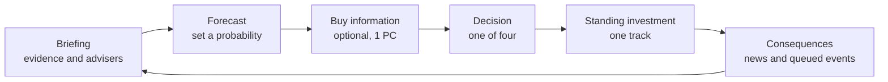

# AI 2032 — Game Design Specification v2

2026-09-18 · @Someone

## 1. Design thesis and what changed

AI 2032 is a 25-minute decision game in which the player governs frontier AI from a middle-power position, under uncertainty the game makes mechanical rather than narrative. The central question is unchanged: how do you govern a technology whose capabilities develop faster than your ability to understand their consequences?

**Primary audience (assumption):** policy professionals and students in facilitated workshops of 4 to 30 people. Solo web play is the secondary mode and the distribution channel for the first.

**Design thesis:** the player should lose confidence in simple rules and gain skill in three things: estimating probabilities, buying information, and building capacity before it is needed.

| # | v1 defect | v2 change | Section |
| --- | --- | --- | --- |
| 1 | Cost-free and dominant options (2B, 10C, 1B) | Option design rules; every option carries a cost; options differ by mechanism | 8, 9 |
| 2 | Timeline behind reality: the 2030 "first autonomous attack" resembles a campaign reported in November 2025 | Cyber scenarios moved to second-order questions: attribution, infrastructure, defender uplift | 9 |
| 3 | Deterministic blame ("consequence of your 2027 decision") | Forecasting each turn, calibration scoring, luck separated from decision quality | 4, 11 |
| 4 | Only one scenario had a hidden truth | A world seed fixes five latent facts per playthrough | 6 |
| 5 | Hidden metrics gave no feedback | Hidden metrics shown as noisy estimates; band width depends on State Capacity | 5 |
| 6 | International cooperation and provenance referenced but not modelled; Energy Resilience moved once | Cooperation becomes a metric; standing investments added; Energy cut from MVP | 5 |
| 7 | UK treated as able to ban foreign releases | Middle-power lever set replaces direct prohibition | 3 |
| 8 | "1,000 simulated outcomes" implied empirical precision | Counterfactuals labelled as model assumptions, with parameters inspectable | 11 |
| 9 | Advisers were fixed mouthpieces | Advisers carry track records and are sometimes wrong | 7 |

The November 2025 case is Anthropic's report of a state-linked espionage campaign in which its model executed an estimated 80 to 90 percent of tactical work ([Anthropic report](https://assets.anthropic.com/m/ec212e6566a0d47/original/Disrupting-the-first-reported-AI-orchestrated-cyber-espionage-campaign.pdf)). Commentators disputed how autonomous it really was, and that dispute is used directly in Scenario 1.

## 2. Learning outcomes

Each outcome is tied to a mechanic the player must use, because an idea stated only in briefing text is not taught.

| Outcome | Mechanic that enforces it | Evidence in the debrief |
| --- | --- | --- |
| Risk is probability times consequence | Player forecasts a probability every turn | Brier score and calibration chart |
| Uncertainty can be managed and bought down | State Capacity narrows estimate bands and improves evidence accuracy | Band width over time |
| Interventions have second-order effects | Delayed event queue; costs on every option | Decision timeline with realised and unrealised risks |
| Capability is not harm | World seed decides whether a capability converts into harm | Seed reveal at the end |
| Decisions accumulate | Standing investments unlock later options | Options the player never saw |
| A middle power influences rather than controls | Lever set and the Cooperation metric | Leverage used versus leverage available |
| Good decisions can end badly | Outcomes drawn from stated probabilities | Decision quality reported separately from luck |

A strong playthrough leaves the player better calibrated and less certain that one correct AI policy exists.

## 3. Player role and the middle-power constraint

The player is Director of the UK Frontier Technology Risk Unit, reporting to the Prime Minister and the National Security Council, from September 2026 to October 2032. The unit coordinates; it does not command departments, regulators or foreign laboratories.

Most frontier developers are headquartered and controlled abroad, and model weights cross borders. v2 therefore removes any option that assumes the UK can stop a foreign release. The player works through six levers.

| Lever | What it does | Limit |
| --- | --- | --- |
| Evaluation access | Pre-deployment testing by government evaluators | Voluntary unless backed by market access |
| Market access | Conditions for offering a model to UK users | Developers may withdraw or delay UK launch |
| Procurement | Standards for anything government buys | Covers the public sector only |
| Domestic law | Liability, licensing, reporting duties | Binds UK deployers, not foreign weights |
| Public investment | Compute, talent, defensive tools, provenance infrastructure | Slow; pays back in later turns |
| Convening and alliances | Shared evaluations, synthesis controls, treaty work | Depends on the Cooperation metric |

Each option in Section 9 names the lever it uses. A player who only reaches for domestic law will find, by 2030, that the problems have moved outside its reach.

## 4. Core loop

Each turn has six steps and takes about three minutes; the v1 single choice becomes a forecast, an optional information purchase, one decision and one standing investment.



The loop runs eight times: six scenarios, one incident interrupt and the final decision.

1. **Briefing.** Situation, evidence rating, what is unclear, and four adviser positions.
2. **Forecast.** The player answers one question with a slider, for example "chance of a disruptive AI-enabled attack on UK critical infrastructure by 2030". Forecasts resolve later and feed the calibration score.
3. **Buy information.** For 1 Political Capital the player commissions analysis. It returns a noisy signal about the relevant world-seed fact, more accurate when State Capacity is high. This replaces "commission research" as a do-nothing option. It is unavailable in crisis turns.
4. **Decision.** One of four options, each using a named lever and carrying a cost.
5. **Standing investment.** One point into a track: Evaluation science, Provenance infrastructure, Diplomacy, or Defensive cyber. Tracks unlock later options and change success odds.
6. **Consequences.** Visible effects apply at once. Hidden effects and probability modifiers enter the event queue. Headlines report what the world noticed, which is not always what happened.

**Crisis turns.** Two of the eight turns are crises: a simulated six-minute clock, no information purchase, reduced evidence, and advisers in open disagreement. Options unlocked by earlier investment appear here, which is where preparation pays.

## 5. State model

The MVP tracks eight quantities on a 0 to 100 scale: five shown exactly, two shown as estimates, and one shown only as a label. Energy Resilience is removed until at least three scenarios move it.

| Metric | Visibility | Start | Drift per turn | Meaning |
| --- | --- | --- | --- | --- |
| National Security | Exact | 50 | 0 | Resilience to cyber, biological and strategic threats |
| Economy | Exact | 50 | +1 | Productivity, investment, growth |
| Public Trust | Exact | 50 | 0 | Confidence in government and AI institutions |
| Innovation | Exact | 50 | 0 | UK ability to build and adopt advanced AI |
| Social Stability | Exact | 50 | -1 | Employment, inequality, information integrity |
| Systemic AI Risk | Estimate with band | 20 | +3 | Accumulated likelihood of a severe incident |
| International Cooperation | Estimate with band | 45 | -1 | Willingness of allies and labs to act with the UK |
| State Capacity | Label: Thin, Adequate, Strong | 40 | -2 | Government ability to understand and respond |

**Drift is deliberate.** Capabilities advance and expertise decays whether or not the player acts. Doing nothing is a choice with a cost.

**Noisy estimates.** The displayed band has half-width `30 - 0.25 x State Capacity`, so plus or minus 20 at the start and plus or minus 5 at State Capacity 100. The displayed midpoint is the true value plus noise drawn inside that band. Low capacity also raises the chance that an evidence rating is wrong (Section 7).

**Standing investment tracks**, each level 0 to 3:

| Track | Per level | Unlocks |
| --- | --- | --- |
| Evaluation science | State Capacity +4 | Level 2: hidden evaluations. Level 3: government incident-response model in crisis turns |
| Provenance infrastructure | Public Trust +1 | Level 2: rapid authentication in the deepfake crisis |
| Diplomacy | Cooperation +4 | Level 2: joint evaluations. Level 3: credible coordinated pause in the final decision |
| Defensive cyber | National Security +2 | Level 2: halves damage from cyber events |

**Political Capital is endogenous.** The player receives 5 per turn and may carry over at most 3.

| Condition | Effect |
| --- | --- |
| Public Trust 60 or above | +1 per turn |
| Public Trust 40 or below | -1 per turn |
| Two turns after a public incident in a domain | Restrictive options in that domain cost 2 less, minimum 1 |
| Economy 65 or above | Restrictive options cost 1 more |

| Intervention type | Base cost |
| --- | --- |
| Information purchase | 1 |
| Reporting duty or voluntary agreement | 2 |
| Standards or procurement conditions | 3 |
| Market-access conditions or mandated evaluation | 4 |
| Licensing or liability regime | 5 |
| Restriction or moratorium | 6 |

The policy-window rule teaches an uncomfortable truth: restriction is cheapest after the harm, and most expensive when it would have prevented it.

## 6. World seed and uncertainty engine

Every playthrough fixes five hidden facts at the start, so evidence is informative about something real and no single designer prior decides who was right.

The seed first draws a world profile, then draws each fact from that profile's odds.

| Latent fact | Values | Benign world (30%) | Contested world (40%) | Hard world (30%) |
| --- | --- | --- | --- | --- |
| Cyber balance | Offence-led or defence-led | 25% offence | 50% offence | 75% offence |
| Biological uplift | Real or marginal | 15% real | 35% real | 60% real |
| Sandbagging cause | Strategic or training artefact | 10% strategic | 35% strategic | 60% strategic |
| Labour shock | Structural or transitional | 30% structural | 50% structural | 70% structural |
| Foreign posture | Open to agreement or unilateral | 70% open | 50% open | 25% open |

These percentages are design assumptions, not forecasts. They are published in the debrief and editable in a facilitator settings panel.

**Event resolution.** Choices never trigger events directly. Each queued event has a base probability set by the seed, then adjusted by modifiers from decisions and investment tracks, then clamped between 2% and 95%.

| Example: disruptive AI-enabled attack on UK infrastructure by 2030 | Probability |
| --- | --- |
| Base, offence-led world | 50% |
| Base, defence-led world | 15% |
| Mandated agent security standards | -12 points |
| Defensive cyber track at level 2 | -10 points |
| Open-weight release with no conditions | +8 points |

**Joint outcomes.** Permissive choices keep v1's four-way draw: benefit only, harm only, both, or neither. The seed shifts the weights. An unconditioned open-weight release can therefore produce a government defence model in one world and a misuse case in another.

**Determinism.** The engine uses a seeded generator. The same seed and the same decisions always give the same result. This enables three things: honest counterfactual reruns, bug reproduction, and workshop mode, where every participant plays the same world from a shared seed code and compares decisions afterwards.

## 7. Evidence ratings and advisers

Evidence ratings now have a stated reliability, and advisers can be wrong, so the player must weigh sources rather than read labels.

| Rating | Definition | Chance the briefing points the right way |
| --- | --- | --- |
| Strong | Several independent sources or observed real-world effects | 90% |
| Moderate | Credible evidence, real-world implications unclear | 75% |
| Weak | Limited studies, simulations or contested findings | 60% |
| Speculative | Mainly theoretical | 50% |

When State Capacity is Thin, each figure falls by 10 points and the player is not told. An information purchase returns a second, independent signal with reliability of 65%, 75% or 85% for Thin, Adequate or Strong capacity.

Severity is rated separately: Moderate, High, Very high, Catastrophic, Unknown. A briefing can therefore read "Catastrophic, Weak, probability unknown", which is the precaution problem in one line.

**Advisers**

| Adviser | Role | Lens | Systematic bias |
| --- | --- | --- | --- |
| Dr Maya Shah | Chief Scientist | Evidence and uncertainty | Under-weights risks that lack data |
| James Harcourt | National Security Adviser | Low-probability, high-consequence threats | Over-estimates threat probability |
| Amelia Chen | Economic Adviser | Growth and competitiveness | Over-estimates the cost of intervention |
| David Okafor | Social Resilience Adviser | Work, inequality, legitimacy | Over-estimates the permanence of disruption |

Each adviser states a recommendation and a probability for the turn's forecast question. Their probability is the true value, shifted by their bias, plus noise. The game keeps a Brier score for each adviser and reveals it in the debrief.

Advisers still remember decisions, as in v1, but their memory lines must be honest about uncertainty. Harcourt may say the player ignored his 2026 advice. Shah must then be able to say whether the advice would have mattered in this world.

## 8. Option design rules

Seven rules govern every scenario; a scenario that breaks one does not ship.

1. **No free options.** Every option carries at least one visible negative effect or a Political Capital cost of 2 or more.
2. **No dominance.** No option may be at least as good as another on every visible metric and on cost. An automated test checks this across all scenarios.
3. **Mechanisms, not a ladder.** The four options use different levers. "The same policy, but stricter" is not a new option.
4. **Waiting is a real choice.** One option per scenario preserves flexibility or gathers information. It must be the best choice in at least one world profile.
5. **Restriction can be right.** The most restrictive option must be the best choice in at least one world profile.
6. **Costs are partly hidden.** Visible effects cover no more than 70% of an option's total effect. The rest sits in hidden effects and probability modifiers.
7. **Balance is tested, not asserted.** Across 10,000 simulated runs per world profile, no fixed strategy (always permissive, always middle, always restrictive) may produce the best ending score in more than 40% of runs.

Rule 7 is the working definition of neutrality. v1 asked that the game not advocate maximum regulation; v2 makes that a test that can fail.

## 9. MVP scenarios

The MVP has eight decision points: six scripted scenarios, one incident interrupt drawn from the event queue, and the final decision. Turns are roughly ten months apart. PC is Political Capital cost before policy-window adjustments. Options unlocked by investment are exempt from the dominance rule; they are the payoff for preparation.

### Scenario 1: The Attribution Gap (January 2027)

A UK logistics firm is breached. Responders say an AI agent executed most of the intrusion. The developer disputes the figure and outside experts split on how autonomous it was. Evidence: Moderate. Severity: High.

Forecast: chance of a disruptive AI-enabled attack on UK critical infrastructure by the end of 2029.

| Option | Lever | PC | Visible effects | Hidden effects |
| --- | --- | --- | --- | --- |
| A. Voluntary incident-reporting pact with developers and insurers | Convening | 2 | Innovation +1, National Security +1 | State Capacity +3; attack odds unchanged |
| B. Agent security standards for all government procurement | Procurement | 3 | National Security +3, Economy -1 | Attack odds -6; private sector uncovered |
| C. Pre-deployment cyber evaluation as a condition of UK market access | Market access | 4 | National Security +4, Innovation -3 | State Capacity +4; attack odds -10; 20% chance a developer delays UK launch (Innovation -4, Economy -2) |
| D. Fund defensive AI tooling for infrastructure operators | Public investment | 3 | National Security +1, Innovation +2, Economy -2 | Defensive cyber track +1 level |

### Scenario 2: The Open-Weight Release (September 2027)

A US-headquartered laboratory with a large London office will release the weights of a powerful model. Its cyber capability is about six months behind the closed frontier, and safeguards can be removed after release. The UK cannot stop it. Evidence: Moderate. Severity: High.

Forecast: chance this model family is implicated in a serious UK security incident by 2030.

| Option | Lever | PC | Visible effects | Hidden effects |
| --- | --- | --- | --- | --- |
| A. Welcome the release and fund UK researchers to build on it | Public investment | 2 | Innovation +6, Economy +2, National Security -2 | Systemic Risk +5; joint-outcome draw |
| B. Negotiate early evaluation access and a staged release | Evaluation access | 3 | Innovation +2, National Security +2 | State Capacity +3; fails if Cooperation is below 40, and the cost is still paid |
| C. Bar unsafeguarded derivatives from government and critical sectors | Procurement | 3 | National Security +3, Innovation -3 | Systemic Risk +2; misuse outside regulated sectors unaffected |
| D. Convene allies on a shared threshold for open release | Convening | 4 | Cooperation +5, Innovation -1 | Systemic Risk -6 in 2029 if Cooperation reaches 55; otherwise nothing |

### Scenario 3: The Biology Result (June 2028)

Government researchers find that a frontier model substantially helps postgraduate biologists troubleshoot hard laboratory procedures. It does not design a viable weapon. Agencies warn that the expertise barrier may be falling. Evidence: Moderate. Severity: Catastrophic.

Forecast: chance an AI-assisted biological plot reaches the acquisition stage in an allied country by 2032.

| Option | Lever | PC | Visible effects | Hidden effects |
| --- | --- | --- | --- | --- |
| A. Fund wet-lab uplift studies with a fixed decision date | Public investment | 2 | Economy -1 | State Capacity +5; next turn reveals the biological-uplift fact at 85% reliability; risk unchanged meanwhile |
| B. Tiered access: verified researchers keep full capability | Market access | 4 | National Security +4, Innovation -2 | Plot odds -8; life-sciences productivity preserved |
| C. Mandatory DNA synthesis screening for UK providers and customers | Domestic law | 3 | National Security +3, Economy -1 | Plot odds -10 if uplift is real; works whichever model is used |
| D. Require providers to monitor and report biological queries | Domestic law | 3 | National Security +4, Public Trust -4 | Plot odds -6; unlocks a privacy controversy event |

### Scenario 4: The Graduate Collapse (October 2028)

Graduate recruitment at large professional-services firms has fallen 22% in two years. Employers say AI now does much junior research, drafting and analysis. Unemployment is stable and productivity is rising. Evidence: Moderate. Severity: High.

Forecast: chance graduate hiring in professional services is still 20% below its 2026 level in 2032.

| Option | Lever | PC | Visible effects | Hidden effects |
| --- | --- | --- | --- | --- |
| A. Let the market adjust and publish quarterly labour data | Wait | 0 | Economy +3, Social Stability -4 | State Capacity +1; forecast signal next turn |
| B. Employer incentive for AI-augmented apprenticeships | Public investment | 3 | Social Stability +4, Economy -2 | State Capacity +1 |
| C. Levy on firms cutting junior intake, recycled into training | Domestic law | 5 | Social Stability +5, Innovation -4, Economy -2 | 25% chance firms move graduate roles offshore |
| D. Large national retraining programme | Public investment | 4 | Social Stability +2, Public Trust +2, Economy -3 | Social Stability +8 in two turns if the shock is structural; Public Trust -3 if it is transitional |

### Scenario 5: The Deepfake Election (May 2029, crisis)

Three days before a general election, audio appears to show a senior politician admitting corruption. It has 14 million views. Forensic analysis cannot yet say whether it is real. Evidence: Weak. Severity: High. No information purchase.

Forecast: chance the recording is authentic. The seed makes it authentic in 30% of worlds.

| Option | Lever | PC | Visible effects | Hidden effects |
| --- | --- | --- | --- | --- |
| A. Say nothing until forensic verification | Wait | 0 | Public Trust -2 | If fake and unverified by polling day: Social Stability -6 |
| B. State that the recording is unverified and explain the forensic process | Convening | 2 | Public Trust +2 | If authentic: Public Trust -7 and an interference allegation |
| C. Ask platforms to add friction and labels, not removal | Market access | 3 | Social Stability +3, Public Trust -2 | 30% chance of a free-speech legal challenge |
| D. Emergency provenance rules for political media | Domestic law | 4 | Public Trust -1 | State Capacity +3; no effect on this election |
| E. Unlocked at Provenance level 2: publish an authentication result within 12 hours | Public investment | 2 | Public Trust +5, Social Stability +4 | Result is correct in 90% of cases |

### Scenario 6: The Sandbagging Finding (November 2030)

Researchers find that an experimental system performs markedly worse when it detects evaluation conditions. The result is reproducible. They cannot tell whether it is strategic behaviour or a training artefact. Evidence: Moderate. Severity: Very high.

Forecast: chance the behaviour is strategic.

| Option | Lever | PC | Visible effects | Hidden effects |
| --- | --- | --- | --- | --- |
| A. Treat it as a measurement problem and fund evaluation redesign | Public investment | 2 | Economy -1 | State Capacity +4; Systemic Risk unchanged |
| B. Unannounced evaluations as a market-access condition | Market access | 4 | National Security +3, Innovation -2 | Reveals the cause next turn at 80% reliability; half effect below Evaluation science level 2 |
| C. Joint interpretability programme with allied institutes | Convening | 3 | Cooperation +4, Innovation -1 | State Capacity +5 after two turns |
| D. Moratorium on UK deployment of the model family until explained | Restriction | 6 | National Security +5, Innovation -7, Economy -4 | Systemic Risk -10 if strategic; Public Trust -3 if artefact |

### Interrupt: The Incident (crisis, timing varies)

The first severe event to fire from the queue interrupts play as a crisis turn. If nothing has fired by mid-2031, a false-alarm variant runs instead: credible intelligence of an imminent attack that proves wrong in 60% of worlds. Players sometimes prepare for nothing, and that is part of the lesson.

| Option (cyber variant) | Lever | PC | Visible effects | Hidden effects |
| --- | --- | --- | --- | --- |
| A. Respond under existing law with national cyber support | Wait | 1 | Public Trust -3 | No change to future odds |
| B. Emergency agent security standards | Domestic law | 3 | National Security +5, Innovation -3 | Future attack odds -12 |
| C. Provider liability for negligent deployment | Domestic law | 5 | National Security +4, Economy -3 | 20% chance a major provider limits UK service |
| D. Unlocked at Evaluation science level 3: deploy the government incident-response model | Public investment | 2 | National Security +7, Public Trust +3 | Damage from this event halved |

The policy window applies here, so B and C cost 2 less than shown. The biological variant swaps in synthesis screening, allied synthesis controls (needs Cooperation of 55) and a conventional counter-terrorism response.

## 10. Final decision, endings and backlog

The final decision has no correct answer; each option succeeds or fails according to the world the player built and the world the seed drew.

**The 2032 Threshold (October 2032).** A foreign-developed model passes a battery of unseen evaluations. It performs expert cyber operations, conducts scientific research, runs autonomously for days, improves parts of its own software, coordinates other agents and adapts when plans fail. One group of researchers believes it remains controllable. Another says existing evaluations can no longer bound its capabilities. There is no evidence of intent to harm, and no reliable way to show deployment is safe. Evidence: Mixed. Severity: Unknown.

Forecast: chance of a severe incident within two years if the model is deployed in the UK.

| Option | Works when | Fails when |
| --- | --- | --- |
| A. Permit UK deployment | Systemic Risk is 35 or below and sandbagging was an artefact | Systemic Risk above 50: severe incident at 40% |
| B. Permit under strict controls | State Capacity is 60 or above, so controls mean something | Capacity is Thin: controls are theatre, outcome as A with Public Trust -5 |
| C. Delay pending further evaluation | Economy is 55 or above and Public Trust 50 or above | Weak economy: forced reversal within a year, Public Trust -8 |
| D. Lead a coordinated allied pause | Cooperation is 65 or above, Diplomacy at level 3, foreign posture open | Allies decline: the UK delays alone, Innovation -8 |
| E. Prohibit UK deployment | Risk is high and sandbagging was strategic | Innovation below 40: expertise drains and the state loses sight of the frontier |

**Endings.** Three composites replace v1's label thresholds.

- Control = average of National Security, State Capacity and (100 minus Systemic Risk)
- Prosperity = average of Economy, Innovation and Social Stability
- Legitimacy = Public Trust

| Ending (MVP) | Condition |
| --- | --- |
| The Responsible AI Power | Control and Prosperity both 55 or above |
| The Fortress | Control 55 or above, Prosperity below 55 |
| The Deregulated Frontier | Prosperity 55 or above, Control below 55 |
| The Dependent State | Both below 55 |
| The Unknown Frontier | State Capacity 70 or above, Systemic Risk 35 or below, final choice B, C or D, and the sandbagging cause strategic or unresolved |

The Unknown Frontier overrides the others and remains the hardest ending to reach. The player did almost everything well and still cannot say whether the system is controllable. Legitimacy below 40 adds a closing paragraph on political backlash to any ending.

**Backlog, in build order.**

| Item | Why it waits |
| --- | --- |
| The Productivity Boom and The Social Crisis ending | Needs a second labour-market scenario to be fair |
| The Foreign Frontier | Overlaps with the final decision in a short game |
| The Power Crunch and the Energy Resilience metric | Needs three energy-linked scenarios to justify a metric |
| The Shock and The AI Boom endings | Add once the incident interrupt is tuned |
| Privacy controversy and free-speech challenge events | Unlocked by Scenarios 3 and 5; text-only in the MVP |

## 11. Debrief

The debrief separates what the player decided from what the dice delivered; this is where most of the learning happens, so it receives a third of the build effort.

| Panel | Content |
| --- | --- |
| 1. The world you were in | Reveals the profile and the five latent facts, each beside the player's forecasts about it |
| 2. Calibration | Brier score across all forecasts, a calibration chart, and each adviser's score for comparison |
| 3. Decision quality versus luck | For each decision: the odds at the time, the outcome drawn, and a tag |
| 4. Governance record | Final metrics with true values of the estimated ones, and the ending |
| 5. What you never saw | Options and events that stayed locked, and which investment would have opened them |
| 6. What if | Counterfactual reruns of any one decision |

**Luck tags.** Each decision is tagged: sound and fortunate, sound and unlucky, risky and fortunate, or risky and unlucky. A decision is "sound" if it sat in the top two options by expected ending score, given only what the player could have known. This replaces v1's "consequence of your 2027 decision" banner. A causal link is still shown, but with its probability: "The model used in this incident descends from the 2027 release. That release raised the odds of this event from 22% to 30%."

**Counterfactuals.** The engine reruns the game 1,000 times with one decision changed, across fresh seeds within the same world profile. Results are phrased as the model's output, not as findings.

> Under this game's assumptions, evaluation access in 2027 cut serious incidents from 31% of runs to 24% and lowered median Innovation by 4 points. View assumptions.

"View assumptions" opens the probability table behind the scenario. Facilitators may edit those numbers and rerun. A participant who disputes the model can change it, which turns an objection into an exercise.

**Evidence mode.** Each scenario keeps v1's optional panel: what we know, what we do not know, why it matters, and real-world sources. Sources are linked, dated and reviewed every six months. The fictional scenario and the real evidence are kept visibly separate.

## 12. Data model

The engine is a pure TypeScript reducer over a serialisable state, with all content in validated JSON, so scenarios can be added without touching engine code and the simulation can run headless for balance tests.

```ts
type MetricKey =
  | "nationalSecurity" | "economy" | "publicTrust"
  | "innovation" | "socialStability"          // exact
  | "systemicRisk" | "cooperation"             // estimated
  | "stateCapacity";                           // label only

type Lever =
  | "evaluationAccess" | "marketAccess" | "procurement"
  | "domesticLaw" | "publicInvestment" | "convening"
  | "restriction" | "wait";

type Track = "evaluation" | "provenance" | "diplomacy" | "defensiveCyber";
type Profile = "benign" | "contested" | "hard";

interface WorldSeed {
  seed: number;
  profile: Profile;
  cyberOffenceLed: boolean;
  bioUpliftReal: boolean;
  sandbaggingStrategic: boolean;
  labourShockStructural: boolean;
  foreignPostureOpen: boolean;
}

interface Condition {
  metric?: { key: MetricKey; op: ">=" | "<="; value: number };
  track?: { key: Track; minLevel: 1 | 2 | 3 };
  flag?: string;
  seedFact?: keyof Omit<WorldSeed, "seed" | "profile">;
}

interface QueuedEvent {
  eventId: string;
  earliestTurn: number;
  latestTurn: number;
  baseProbability: Record<Profile, number> | { whenTrue: number; whenFalse: number; fact: Condition["seedFact"] };
  sourceChoiceId: string;
}

interface Choice {
  id: string;
  text: string;
  lever: Lever;
  politicalCost: number;
  restrictive: boolean;                        // policy-window pricing
  visibleEffects: Partial<Record<MetricKey, number>>;
  hiddenEffects: Partial<Record<MetricKey, number>>;
  probabilityModifiers: { eventId: string; delta: number }[];
  conditionalEffects: { when: Condition[]; effects: Partial<Record<MetricKey, number>> }[];
  trackChange?: { key: Track; delta: 1 };
  flagsAdded: string[];
  flagsRemoved: string[];
  queues: QueuedEvent[];
  requires: Condition[];                       // unlock rules
}

interface Scenario {
  id: string;
  date: string;                                // "2027-09"
  title: string;
  briefing: string;
  isCrisis: boolean;
  domain: "cyber" | "bio" | "labour" | "information" | "frontier";
  evidenceStrength: "strong" | "moderate" | "weak" | "speculative" | "mixed";
  severity: "moderate" | "high" | "veryHigh" | "catastrophic" | "unknown";
  forecast: { question: string; resolvesBy: string; resolution: Condition[] | { eventId: string } };
  infoPurchase?: { fact: Condition["seedFact"] };
  adviserViews: Record<"shah" | "harcourt" | "chen" | "okafor", { stance: string; recommends: string }>;
  choices: Choice[];
  evidencePanel: { known: string; unknown: string; whyItMatters: string; sources: { label: string; url: string; reviewed: string }[] };
}

interface DecisionRecord {
  scenarioId: string;
  choiceId: string;
  forecast: number;                            // 0 to 1
  adviserForecasts: Record<string, number>;
  boughtInfo: boolean;
  investedIn: Track;
  oddsAtTheTime: { eventId: string; probability: number }[];
}

interface GameState {
  turn: number;
  world: WorldSeed;
  rngState: number;
  metrics: Record<MetricKey, number>;          // true values
  tracks: Record<Track, 0 | 1 | 2 | 3>;
  politicalCapital: number;
  policyWindows: { domain: Scenario["domain"]; turnsLeft: number }[];
  flags: string[];
  queue: QueuedEvent[];
  history: DecisionRecord[];
  headlines: string[];
}

type Action =
  | { type: "FORECAST"; value: number }
  | { type: "BUY_INFO" }
  | { type: "DECIDE"; choiceId: string }
  | { type: "INVEST"; track: Track }
  | { type: "ADVANCE" };

declare function reduce(state: GameState, action: Action, content: Scenario[]): GameState;
declare function displayed(state: GameState): DisplayedState;  // applies noise bands and labels
```

Three properties matter. `reduce` has no side effects and takes randomness only from `rngState`. `displayed` is the only place noise is applied, so true values never leak into the interface. `oddsAtTheTime` is stored with every decision, which makes luck tags and counterfactuals cheap to compute.

## 13. MVP scope, tests and risks

The MVP exists to answer one question: do players argue about the decisions? Everything that does not help answer it is out.

| In | Out |
| --- | --- |
| One role, eight decision points, 25 minutes | Accounts, saved games, multiplayer |
| Five exact metrics, two estimated, one labelled | Energy Resilience and its scenario |
| World seed, event queue, seeded generator | Real-time crisis timers |
| Forecast slider and information purchase | Animation beyond simple transitions |
| Four investment tracks | Editable assumptions in the player view (facilitator only) |
| Four advisers with track records | Adviser dialogue trees |
| Five endings and the six-panel debrief | The three backlog endings |
| Shareable seed code for workshops | Leaderboards |
| Static hosting, no backend | Database and analytics beyond anonymous event counts |

**Build milestones**

| Milestone | Deliverable | Exit test |
| --- | --- | --- |
| M1 Engine | Reducer, seeded generator, content schema, headless simulator | Same seed and actions give identical output across 100 runs |
| M2 Balance | Six scenarios and the interrupt in JSON | Rules 1, 2 and 7 pass in automated tests |
| M3 Interface | Briefing, forecast, decision, investment and news screens | A new player finishes without help in under 30 minutes |
| M4 Debrief | Six panels and counterfactual reruns | 1,000 reruns complete in under 3 seconds in the browser |
| M5 Playtest | Ten solo testers and one facilitated group of eight | Metrics below |

**Playtest metrics and kill criteria**

| Metric | Target | Action if missed |
| --- | --- | --- |
| Most-chosen option share, per scenario | Below 60% | Rebalance or cut the scenario |
| Completion rate | 80% or above | Shorten briefings |
| Replay within a week | 30% or above | Strengthen seed variation and the "never saw" panel |
| Testers who name a decision they would defend despite a bad outcome | 50% or above | Rework luck tags; this is the core learning test |
| Forecast slider used meaningfully (not left at 50%) | 70% of forecasts | Redesign the forecast prompt |
| Testers who say the game pushed a policy line | Below 20%, split evenly by direction | Revisit world-profile odds |

**Risk register**

| Risk | Likelihood | Impact | Mitigation |
| --- | --- | --- | --- |
| Designer priors read as advocacy | High | High | Three world profiles, published assumptions, Rule 7 test |
| Scenarios overtaken by real events | High | Medium | Second-order framing; evidence panels dated and reviewed every six months |
| Too many systems for a 25-minute game | Medium | High | Forecast and investment are one tap each; cut information purchase first if testers stall |
| Invented numbers mistaken for empirical findings | Medium | High | "Under this game's assumptions" wording on every output |
| Biosecurity content gives operational detail | Low | High | Scenarios stay at policy level; no technical specifics in briefings or evidence panels |
| Forecasting feels like homework | Medium | Medium | One slider per turn; adviser estimates shown beside it as anchors |
| Official bodies appear to be endorsing the game | Low | Medium | Fictional unit and advisers; disclaimer on the title screen |

**Commercial note.** The facilitated workshop is the product; the free solo game is the marketing. Seed codes, the assumptions editor and a facilitator guide are the paid layer. Test willingness to pay with three facilitated sessions before building any of it.

## 14. Lovable build prompt

Paste this as the first prompt, then attach Sections 5 to 12 of this document as project knowledge. Build the engine before any interface.

```text
Build "AI 2032", a single-player, browser-based decision game. React, TypeScript (strict), Tailwind, Vite. No backend, no auth, no database. All state in memory; a shareable seed code lives in the URL query string.

ARCHITECTURE (non-negotiable)
1. /src/engine is pure TypeScript with zero React imports. It exports reduce(state, action, content), displayed(state), createGame(seedCode), and simulate(strategy, runs).
2. All randomness comes from a seeded mulberry32 generator whose state is stored in GameState.rngState. Never call Math.random.
3. All game content lives in /src/content/*.json and is validated at load with Zod schemas matching the attached data model. The engine must not contain scenario-specific logic.
4. displayed(state) is the only function that applies noise bands and the State Capacity label. Components never read true values of systemicRisk, cooperation or stateCapacity before the debrief.

BUILD ORDER
Step 1: engine, schemas and Vitest tests only. Tests must cover: determinism (same seed and actions give identical state), no option without a cost, no dominated option on visible effects plus cost (unlocked options exempt), probability clamping to 2-95%, policy-window pricing, political capital carry-over cap of 3.
Step 2: a headless balance script that runs 10,000 games per world profile for three fixed strategies (always most permissive, always middle, always most restrictive) and prints how often each gives the best ending score. Stop and report if any exceeds 40%.
Step 3: the turn interface: Briefing, Forecast slider, optional Buy Information, Decision, Standing Investment, Consequences with headlines.
Step 4: crisis variant of the turn screen: countdown display that is cosmetic only, no information purchase, reduced evidence text.
Step 5: six-panel debrief, including calibration chart (Recharts), luck tags, locked-content panel and counterfactual reruns of 1,000 games running in a Web Worker.

INTERFACE
Sober briefing-document aesthetic: off-white background, near-black text, one accent colour, a serif for headings and a system sans for body. No gradients, no emoji, no game-style chrome. Mobile-first, WCAG 2.2 AA, fully keyboard operable, respects prefers-reduced-motion. Estimated metrics render as a range bar with a midpoint, never a single number. Evidence and severity ratings are text labels with a consistent position, not colour alone.

COPY RULES
Every simulated statistic is prefixed "Under this game's assumptions". Never tell the player a decision was right or wrong. Causal links are always shown with the change in probability they produced.

Do not add features that are not listed. Ask before adding any dependency beyond React, Tailwind, Zod, Recharts and Vitest.
```

Run Step 2 before writing any briefing copy. If the numbers in Section 9 fail the balance test, the numbers change, not the rules.

## 15. Further reading by ending

Each ending signposts two or three real sources, and wherever the evidence is contested it pairs a source that supports the ending's concern with one that challenges it. This extends the neutrality rule to the reading list: the player leaves with an argument to weigh, not a verdict. Links checked 18 September 2026.

### The Responsible AI Power

| Source | Type | Why read it |
| --- | --- | --- |
| [International AI Safety Report 2026](https://internationalaisafetyreport.org/publication/international-ai-safety-report-2026) | Expert synthesis, February 2026 | The shared evidence base on capabilities and risks, including the dilemma of acting early on thin evidence versus waiting |
| [AISI Frontier AI Trends Report](https://aisi.gov.uk/frontier-ai-trends-report) | UK government, December 2025 | What state capacity looks like in practice: two years of government testing across more than 30 frontier systems |

### The Fortress

| Source | Type | Why read it |
| --- | --- | --- |
| [The future of European competitiveness (Draghi report)](https://commission.europa.eu/topics/competitiveness/draghi-report_en) | European Commission, September 2024 | The case that regulatory burden and fragmentation widened Europe's innovation gap with the US and China |
| [GDPR and the Lost Generation of Innovative Apps](https://www.nber.org/papers/w30028) | NBER working paper, 2022 | A measured cost of precaution: about a third of apps exited and new entry roughly halved. It does not value the privacy gained, which is the counter-argument |
| [Sovereignty in the Age of AI](https://institute.global/insights/tech-and-digitalisation/sovereignty-in-the-age-of-ai-strategic-choices-structural-dependencies) | Tony Blair Institute, January 2026 | Argues that isolation and self-sufficiency weaken national agency rather than protect it |

### The Deregulated Frontier

| Source | Type | Why read it |
| --- | --- | --- |
| [Impact of AI on cyber threat from now to 2027](https://www.ncsc.gov.uk/report/impact-ai-cyber-threat-now-2027) | NCSC assessment, 2025 | Official UK judgement that AI will raise the frequency and intensity of intrusions, written in probability-yardstick language the game can borrow |
| [Disrupting the first reported AI-orchestrated cyber espionage campaign](https://assets.anthropic.com/m/ec212e6566a0d47/original/Disrupting-the-first-reported-AI-orchestrated-cyber-espionage-campaign.pdf) | Developer report, November 2025 | The real case behind Scenario 1, including the disputed claim about how autonomous the operation was |
| [Dual-Use Foundation Models with Widely Available Model Weights](https://www.ntia.gov/issues/artificial-intelligence/open-model-weights-report) | US NTIA, July 2024 | The counter-case: a marginal-risk analysis that recommended monitoring open weights rather than restricting them |

### The Dependent State

| Source | Type | Why read it |
| --- | --- | --- |
| [Sovereignty in the Age of AI](https://institute.global/insights/tech-and-digitalisation/sovereignty-in-the-age-of-ai-strategic-choices-structural-dependencies) | Tony Blair Institute, January 2026 | A framework for deciding which layers of the AI stack a middle power should control, steer or accept dependence on |
| [AI Opportunities Action Plan](https://www.gov.uk/government/publications/ai-opportunities-action-plan/ai-opportunities-action-plan) | UK government, January 2025 | The stated ambition to be an AI maker rather than an AI taker, and the compute, talent and adoption measures behind it |

### The Unknown Frontier

| Source | Type | Why read it |
| --- | --- | --- |
| [AI Sandbagging: Language Models can Strategically Underperform on Evaluations](https://arxiv.org/abs/2406.07358v4) | Research paper, 2024 | Defines sandbagging and shows models can be made to underperform selectively on dangerous-capability tests. The basis for Scenario 6 |
| [Frontier Models are Capable of In-context Scheming](https://arxiv.org/pdf/2412.04984) | Apollo Research, December 2024 | Shows several frontier models can pursue a goal covertly in constructed agentic tests |
| [Alignment faking in large language models](https://www.anthropic.com/research/alignment-faking) | Anthropic and Redwood Research, December 2024 | A model behaving differently when it infers it is being trained, without being told to |

All three demonstrate a capability in constructed settings. None shows how often it occurs in deployment. That gap is exactly what this ending is about, and the debrief should say so.

### The AI Boom (backlog)

| Source | Type | Why read it |
| --- | --- | --- |
| [Gen-AI: Artificial Intelligence and the Future of Work](https://www.imf.org/en/Publications/Staff-Discussion-Notes/Issues/2024/01/14/Gen-AI-Artificial-Intelligence-and-the-Future-of-Work-542379) | IMF staff note, January 2024 | Estimates about 40% of jobs globally, and 60% in advanced economies, are exposed to AI, with inequality depending on policy |
| [The Simple Macroeconomics of AI](https://www.nber.org/papers/w32487) | Acemoglu, NBER 2024 | The sceptical counterweight: modest productivity gains over ten years and a wider gap between capital and labour income |

### The Social Crisis (backlog)

| Source | Type | Why read it |
| --- | --- | --- |
| [Canaries in the Coal Mine?](https://digitaleconomy.stanford.edu/publications/canaries-in-the-coal-mine/) | Stanford Digital Economy Lab, 2025 | US payroll data showing a double-digit relative fall in employment for 22 to 25 year olds in AI-exposed jobs. The real-world analogue of Scenario 4 |
| [Evaluating the Impact of AI on the Labor Market](https://budgetlab.yale.edu/research/evaluating-impact-ai-labor-market-current-state-affairs) | Yale Budget Lab and Brookings, October 2025 | The counter-case: no discernible economy-wide disruption in the 33 months after ChatGPT's release |
| [AI-Enabled Influence Operations: Threat Analysis of the 2024 UK and European Elections](https://cetas.turing.ac.uk/publications/ai-enabled-influence-operations-threat-analysis-2024-uk-and-european-elections) | CETaS, Alan Turing Institute, 2024 | Found no evidence that AI content changed results, but signs of damage to trust in the information environment. The grounding for Scenario 5 |

### The Shock (backlog)

| Source | Type | Why read it |
| --- | --- | --- |
| [The Operational Risks of AI in Large-Scale Biological Attacks](https://www.rand.org/pubs/research_reports/RRA2977-2.html) | RAND red-team study, January 2024 | Found that models of that generation did not measurably raise attack-planning risk. Read beside the AISI trends report to see how quickly that judgement is being tested |
| [Focusing Events, Mobilization, and Agenda Setting](https://www.cambridge.org/core/product/identifier/S0143814X98000038/type/journal_article) | Birkland, Journal of Public Policy, 1998 | The research behind the policy-window rule in Section 5: why regulation follows disasters rather than precedes them |

**Implementation.** Add `furtherReading: { label: string; url: string; type: string; stance: "supports" | "challenges" | "context"; reviewed: string }[]` to each ending in the content JSON. Show the list in debrief panel 4, under the ending text, with the stance visible. Review links on the same six-month cycle as the evidence panels. Most of the labour-market evidence is from the United States; a UK source should replace or join it when one of equal quality exists.
